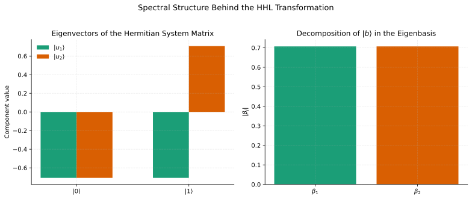
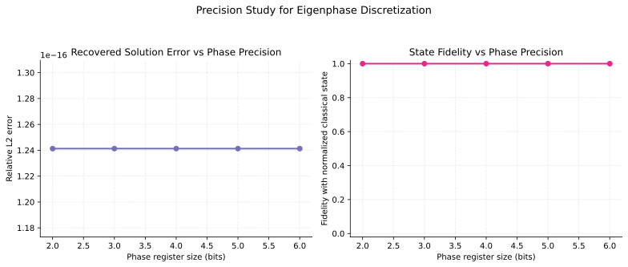

# HHL Algorithm in Qiskit: From Quantum Linear Systems to Executable Circuits

[](https://www.python.org/)
[](https://qiskit.org/)
[](./tests)
[](./LICENSE)

This repository bridges the gap between the mathematical formulation of HHL and an executable Qiskit circuit, with explicit statevector inspection, eigenvalue inversion, and postselected solution recovery.

It is designed as a compact scientific-computing artifact rather than a notebook dump: the code is packaged, the theory is documented, the figures are reproducible, the statevector is inspectable, and the numerical agreement with the classical solution is measured directly.


## Why This Repository Exists

Most HHL examples stop at a high-level circuit sketch or a symbolic derivation. This project focuses on the missing middle:

1. Classical linear system
2. Quantum state encoding
3. Phase estimation
4. Eigenvalue inversion
5. Uncomputation
6. Postselection
7. Solution comparison

The result is a small but rigorous implementation that makes each stage of the algorithm visible in code, figures, and tests.

## Problem Instance

The repository studies the fixed Hermitian system

\[
A x = b, \qquad
A =
\begin{bmatrix}
1 & -1/3 \\
-1/3 & 1
\end{bmatrix},
\qquad
b =
\begin{bmatrix}
1 \\
0
\end{bmatrix},
\qquad
t = \frac{3\pi}{4}.
\]

This choice of evolution time is deliberate: the eigenphases of \(e^{iAt}\) are exactly representable on a two-qubit phase register, which makes the mechanics of HHL especially transparent.

## Installation

```bash
python3 -m venv .venv
source .venv/bin/activate
pip install -r requirements.txt
```

For package-oriented local development, you can also run:

```bash
pip install -e .
```

## Quick Start

```bash
python3 scripts/run_hhl_demo.py
```

Useful options:

```bash
python3 scripts/run_hhl_demo.py --hide-statevector
python3 scripts/run_hhl_demo.py --precision-max-bits 8
python3 scripts/run_hhl_demo.py --save-json results/hhl_summary.json
```

This script:
- builds the full HHL circuit
- simulates the final statevector
- extracts the postselected solution amplitudes
- prints fidelity and relative error against the normalized classical solution
- performs a precision sweep over discretized eigenphases
- regenerates all figures under `docs/figures/`

Main notebook:

`notebooks/QComp-TP-2-TP-HHL.ipynb`

This is the central notebook of the project: a solved and cleaned adaptation of the original QComp HHL session, rewritten to align with the package, figures, and numerical analysis in the repository.

## Repository Structure

```text
.
├── README.md
├── pyproject.toml
├── requirements.txt
├── Makefile
├── AGENTS.md
├── .github/workflows/ci.yml
├── src/hhl_lab/
│   ├── analysis.py
│   ├── hhl.py
│   ├── inversion.py
│   ├── matrices.py
│   ├── qpe.py
│   ├── simulation.py
│   └── visualization.py
├── notebooks/QComp-TP-2-TP-HHL.ipynb
├── notebooks/01_hhl_algorithm_walkthrough.ipynb
├── scripts/
├── docs/
├── tests/
└── examples/minimal_hhl.py
```

## Visual Overview





## Mathematical Thread

The implementation follows the canonical HHL workflow:

1. Encode `b` as the state `|b⟩`.
2. Use quantum phase estimation on `U = exp(iAt)` to encode eigenvalue information in the clock register.
3. Apply a basis-controlled `R_y` rotation so that the ancilla amplitude scales as `C / λ_j`.
4. Uncompute phase estimation.
5. Postselect on the inversion ancilla being `|1⟩`.
6. Extract the system register amplitudes from the postselected branch.

The helper `extract_solution_vector(...)` makes the postselection explicit: it isolates only the amplitudes with the ancilla in the accepting state and the phase register returned to `|00⟩`.

## Core Numerical Results

For this instance,

\[
x = A^{-1} b =
\begin{bmatrix}
9/8 \\
3/8
\end{bmatrix},
\qquad
\frac{x}{\|x\|} =
\begin{bmatrix}
0.948683 \\
0.316228
\end{bmatrix}.
\]

The simulated postselected HHL state is aligned with the same direction:

\[
|x_{\mathrm{HHL}}\rangle =
\begin{bmatrix}
0.948683 \\
0.316228
\end{bmatrix}.
\]

### Results Table

| Quantity | Value |
| --- | ---: |
| Classical solution \(x\) | \([1.125,\;0.375]\) |
| Raw postselected amplitudes | \([0.75,\;0.25]\) |
| Normalized classical state | \([0.948683,\;0.316228]\) |
| Normalized HHL state | \([0.948683,\;0.316228]\) |
| Postselection success probability | `0.625000` |
| State fidelity with classical normalized state | `1.000000` |
| Relative \(L^2\) error | `8.29e-16` |

The raw postselected amplitudes are proportional to the classical vector:

\[
\begin{bmatrix}
3/4 \\
1/4
\end{bmatrix}
\propto
\begin{bmatrix}
9/8 \\
3/8
\end{bmatrix}.
\]

That proportionality is the central numerical signature of a successful HHL recovery.

## Numerical Analysis

This repository now includes a small analysis layer in `src/hhl_lab/analysis.py`:

- spectral decomposition of the problem Hamiltonian
- decomposition coefficients of `|b⟩` in the eigenbasis
- state fidelity and relative error metrics
- an eigenphase discretization sweep across register sizes

For the canonical problem, the precision study is especially instructive:

| Phase bits | Encoded eigenvalue states | Fidelity | Relative error | Interpretation |
| --- | --- | ---: | ---: | --- |
| 1 | `0`, `1` | undefined | undefined | the smaller eigenphase aliases to zero, so inversion fails |
| 2 | `01`, `10` | `1.000000` | `1.24e-16` | exact representation |
| 3+ | exact binary refinement | `1.000000` | `1.24e-16` | no further improvement needed |

This is a nice pedagogical feature of the chosen example: two phase qubits are already sufficient because the eigenphases were engineered to land exactly on the binary grid.




## Theory Note

The file [docs/theory.tex](docs/theory.tex) is written as a compact scientific note rather than an appendix. It explains:

- spectral decomposition of the system matrix
- construction of `U = exp(iAt)`
- phase encoding on a finite clock register
- controlled reciprocal rotation
- postselection and solution recovery
- interpretation of the resulting amplitudes

When `pdflatex` is available, compile it with:

```bash
python3 scripts/compile_latex.py
```

## Notebook Walkthrough

The main notebook is [notebooks/QComp-TP-2-TP-HHL.ipynb](notebooks/QComp-TP-2-TP-HHL.ipynb). It is the central narrative artifact of the repository and covers:

- statevector conventions and basis ordering
- the fixed HHL case study and exact eigenphase encoding
- the inversion oracle logic
- full HHL recovery and postselection
- parameter and precision analysis
- the signed-eigenvalue extension discussed in the original course material

A shorter companion notebook, [notebooks/01_hhl_algorithm_walkthrough.ipynb](notebooks/01_hhl_algorithm_walkthrough.ipynb), remains available as a compact package-first walkthrough. It covers:

- the matrix and its eigenstructure
- why the chosen evolution time is special
- the circuit construction
- the recovered postselected amplitudes
- the interpretation of the solution direction
- the precision study and generated figures

## Figure Gallery

Generated and committed figure assets include:

- `circuit_hhl.svg`
- `inversion_oracle.svg`
- `solution_comparison.svg`
- `statevector_distribution.svg`
- `success_probability.svg`
- `eigenvalue_encoding.svg`
- `spectral_decomposition.svg`
- `precision_sweep.svg`

## Tests

Run the test suite with:

```bash
python3 -m pytest
```

The tests cover:

- bitstring conversion and normalization helpers
- unitarity of `exp(iAt)`
- correctness of inversion-rotation amplitudes
- phase-estimation encodings for the canonical example
- proportionality of the recovered HHL state to `[9/8, 3/8]`
- fidelity of the postselected HHL state with the normalized classical solution

## Limitations

This is an educational, small-scale implementation. It is not a scalable sparse-Hamiltonian simulation, nor a complexity-theoretic benchmark of HHL in the fault-tolerant regime. The project intentionally prioritizes interpretability over asymptotic performance.

## Future Work

- Generalize to larger Hermitian systems
- Add Trotterized Hamiltonian simulation
- Support higher-precision QPE at the circuit level
- Add noisy simulation and error-mitigation experiments
- Execute the construction on IBM Quantum backends
