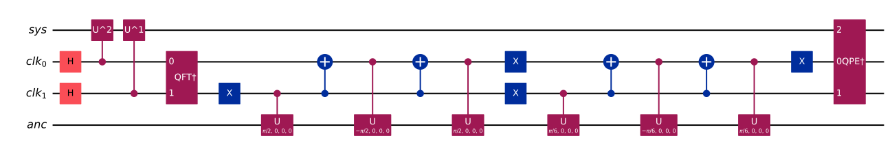
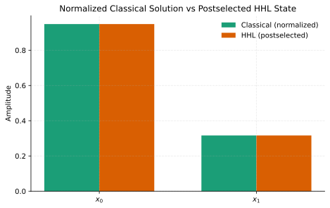
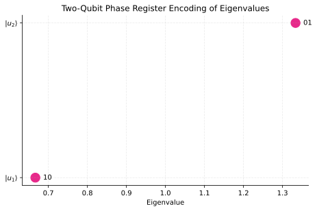
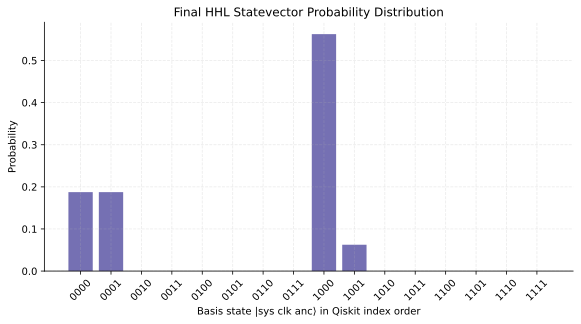

# HHL Algorithm in Qiskit: From Quantum Linear Systems to Executable Circuits

[](https://www.python.org/)
[](https://qiskit.org/)
[](./tests)
[](./LICENSE)

This repository bridges the gap between the mathematical formulation of HHL and an executable Qiskit circuit, with explicit statevector inspection, eigenvalue inversion, and postselected solution recovery.

It presents a compact, portfolio-ready implementation of the Harrow-Hassidim-Lloyd algorithm for a fixed `2x2` Hermitian linear system. The project is structured as a reusable Python package with reproducible figures, tests, theory notes, and a pedagogical notebook.



## Visual Storytelling

1. Classical linear system
2. Quantum state encoding
3. Phase estimation
4. Eigenvalue inversion
5. Uncomputation
6. Postselection
7. Solution comparison

## Problem Instance

The repository studies the system

\[
A x = b, \quad
A =
\begin{bmatrix}
1 & -1/3 \\
-1/3 & 1
\end{bmatrix},
\quad
b =
\begin{bmatrix}
1 \\
0
\end{bmatrix},
\quad
t = \frac{3\pi}{4}.
\]

For this choice of `t`, the eigenphases of `exp(i A t)` align cleanly with a two-qubit phase register, making the mechanism of HHL especially transparent.

## Repository Overview

```text
.
├── README.md
├── pyproject.toml
├── requirements.txt
├── Makefile
├── AGENTS.md
├── .github/workflows/ci.yml
├── src/hhl_lab/
├── notebooks/01_hhl_algorithm_walkthrough.ipynb
├── scripts/
├── docs/
├── tests/
└── examples/minimal_hhl.py
```

## Installation

```bash
python3 -m venv .venv
source .venv/bin/activate
pip install -r requirements.txt
```

For package-style development, you can also install the project itself:

```bash
pip install -e .
```

## Quick Start

```bash
python scripts/run_hhl_demo.py
```

This command:
- builds the full HHL circuit
- simulates the final statevector
- extracts the postselected solution amplitudes
- compares the normalized HHL state with the classical normalized solution
- saves publication-style figures under `docs/figures/`

## Visual Overview

The project follows a deliberate seven-step narrative:

1. Start from a classical Hermitian linear system.
2. Encode the right-hand side vector as a quantum state.
3. Use quantum phase estimation to encode the eigenvalues of `A`.
4. Apply a controlled ancilla rotation implementing reciprocal weighting.
5. Uncompute the phase register.
6. Postselect on the ancilla qubit.
7. Compare the recovered amplitudes with the normalized classical solution.





## Mathematical Thread

The implementation follows the canonical HHL workflow:

1. Encode `b` as a quantum state `|b⟩`.
2. Apply quantum phase estimation to encode eigenvalues of `A` into a clock register through `U = exp(iAt)`.
3. Perform a controlled `R_y` rotation whose ancilla amplitude scales like `C / λ_j`.
4. Uncompute phase estimation.
5. Postselect on the inversion ancilla being `|1⟩`.
6. Read off a state proportional to `A^{-1}|b⟩`.

Because the postselected amplitudes scale as `β_j / λ_j` in the eigenbasis, the final one-qubit system register is proportional to the classical solution vector.

In the final statevector, the useful branch is the component where the inversion ancilla is measured in `|1⟩` and the phase register has been uncomputed back to `|00⟩`. The helper `extract_solution_vector(...)` isolates exactly those amplitudes, making the postselection step explicit rather than implicit.

## Results

For the fixed example in this repository, the classical solution is

\[
x = A^{-1}b =
\begin{bmatrix}
9/8 \\
3/8
\end{bmatrix}.
\]

The simulated HHL output is compared against the normalized classical solution, along with the postselection success probability and the full statevector probability distribution.

For this example, the raw postselected amplitudes are proportional to

\[
\begin{bmatrix}
3/4 \\
1/4
\end{bmatrix}
\propto
\begin{bmatrix}
9/8 \\
3/8
\end{bmatrix},
\]

so normalizing the postselected branch reproduces the same direction as the classical solution.

## Figure Previews

Generated assets are written to `docs/figures/` and committed with the repository:

- `solution_comparison.svg`
- `statevector_distribution.svg`
- `eigenvalue_encoding.svg`
- `success_probability.svg`
- `circuit_hhl.svg`
- `inversion_oracle.svg`

## Theory Notes

The file [docs/theory.tex](/Users/karimelhoudaigui/Desktop/QUANTUM_ALGORITHM/docs/theory.tex) provides a compact derivation of the algorithm and is designed to compile into `docs/theory.pdf` when `pdflatex` is available.

## Tests

```bash
pytest
```

The test suite checks:
- bitstring and normalization helpers
- matrix construction and unitarity of `exp(iAt)`
- inversion oracle rotation amplitudes
- correct eigenvalue phase encoding
- proportionality of the recovered HHL state to `[9/8, 3/8]`

## Limitations

This is an educational small-scale implementation, not a scalable sparse-Hamiltonian simulation. The code intentionally focuses on explicit statevector inspection and interpretability rather than asymptotic performance.

## Future Work

- Generalize to larger Hermitian systems
- Add Trotterized Hamiltonian simulation
- Increase phase precision beyond two clock qubits
- Study noise-aware simulation
- Run the circuit on IBM Quantum backends
